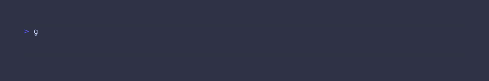

# InStyle



InStyle is a small library for efficiently decorating strings with ANSI escape codes.

## Syntax

The tags follow the following format:

```
[!style]text to be styled[/]
```

Style can be a named style, or a raw value to be used in an ANSI escape code.
For example, both of these will turn the text red:

```
[!red]this text will show up as red[/]
[!31]this text will show up as red[/]
```

The ending sequence of `[/]` can be fully omitted for minor performance gains like so:

```
[!italic]ending tags need not be included
```

### Multiple Styles

Multiple styles can be added by using the `+` character between each style desired.

```
[!magenta+bold]this text has two styles[/]
```

### Nesting & Sequential Tags

Up to 5 tags can be nested.
All unclosed tags are terminated at the end of a string.

```
[!cyan]i never said [!bold]you[/] did that[/]... [!italic]somebody else[/] did
```

### Named Styles

<details>

<summary>Complete list of default styles.</summary>

#### Text Styling

- `plain`
- `reset`
- `bold`
- `faint`
- `italic`
- `underline`
- `blink`
- `strike`

#### Basic Colors

- `black`
- `red`
- `green`
- `yellow`
- `blue`
- `magenta`
- `cyan`
- `white`
- `default`

#### Basic Backgrounds

- `bg-black`
- `bg-red`
- `bg-green`
- `bg-yellow`
- `bg-blue`
- `bg-magenta`
- `bg-cyan`
- `bg-white`
- `bg-default`

#### Light Colors

- `light-black`
- `light-red`
- `light-green`
- `light-yellow`
- `light-blue`
- `light-magenta`
- `light-cyan`
- `light-white`

#### Light Backgrounds

- `bg-light-black`
- `bg-light-red`
- `bg-light-green`
- `bg-light-yellow`
- `bg-light-blue`
- `bg-light-magenta`
- `bg-light-cyan`
- `bg-light-white`

</details>

Aside from the named styles, additional styles can be added to a `Styler` instance by using the `Register` method.
This can be used to associated more than one ANSI escape code to a name.

```go
s := instyle.NewStyler()
s.Register("error", "1;31") // Bold and red
```

A style name can only be a maximum of 15 characters long.

## Performance

While applying a set of styles, this code runs ~2-3x slower than an unbuffered copy of an array of runes:

```go
// ideal performance goal:
var dst []rune
for _, r := range []rune("...") {
    dst = append(dst, r)
}
```

However, when compared a regex solution or using [Lip Gloss](https://github.com/charmbracelet/lipgloss) directly this will perform about 5-10x faster.

Running on a M2 2022 MacBook Air, the truncated / formatted benchmark results look like:

```
BenchmarkBaseline/BestCase-8              15542974      70 ns/op
BenchmarkBaseline/PerformanceGoal-8        4497812     266 ns/op
BenchmarkApply/NoStyle-8                   4112559     291 ns/op
BenchmarkApply/WithStyle-8                 1775058     677 ns/op
BenchmarkApply/WithStyleToFromString-8      747465    1581 ns/op
BenchmarkSimilarLipGloss-8                  129320    9212 ns/op
```
